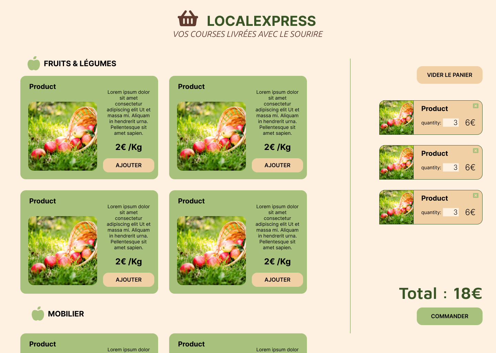

# 🛒🧺 LocalExpress

## ✏️ Description

- 🖥️ API REST + SPA
- 🛒 E-boutique de vente locale

## 📦 Package

- ⚡ Environnement Vite
- ⚛️ React
  - 🛣️ React-router
- 🕸️ Redux
  - 🆚 Branch React Context
- 🧪 Biome
- ⚡ Vitest
- 📝 TypeScript
- 😎 Sass

## 💠 Conception

- [User Stories](./docs/user-stories.png)
- [Use Cases](./docs/diagramme_use-case.png)
- [Diagramme d'activité](./docs/diagramme_activite.png)
- [Diagramme de sequence](./docs/diagramme_sequence.png)
- [Diagramme de realation-association](./docs/diagramme_edr.png)

## 🖼️ Maquette Graphique

## 🚀 CI/CD

[gh-pages](https://damien-ancelin.github.io/LocalExpress/)

- 🍋‍🟩 MàJ: 09/02/2025
- 🍉 MàJ: 14/02/2025

[netlify](https://projectlocalexpress.netlify.app/accueil)

- 🍎 Mise en place: 14/02/2025
